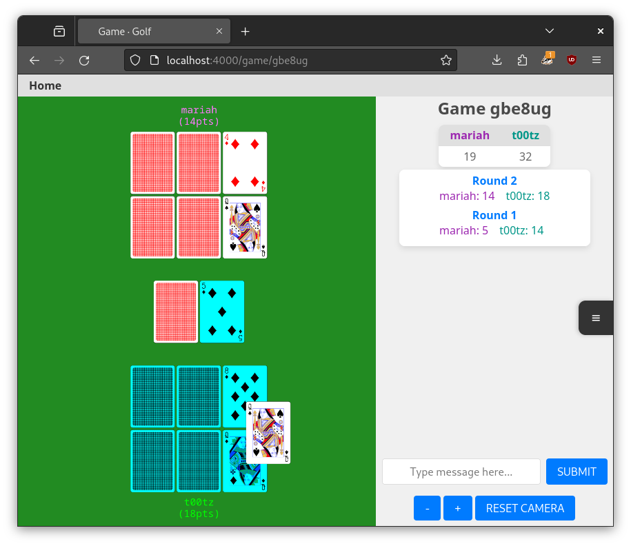

# Golf

To start your Phoenix server:

  * Run `mix setup` to install and setup dependencies
  * Start Phoenix endpoint with `mix phx.server` or inside IEx with `iex -S mix phx.server`

Now you can visit [`localhost:4000`](http://localhost:4000) from your browser.

Ready to run in production? Please [check our deployment guides](https://hexdocs.pm/phoenix/deployment.html).

## URL

The game can be played at [agolf.fly.dev](https://agolf.fly.dev/)

## Game rules

### Objective
- Aim to get the lowest score possible by matching ranks of cards.

### Setup
- Each player is dealt **6 face-down cards**.
- The game consists of **n+1 rounds**, where n equals the number of players.

### Gameplay

#### Starting the Round
- At the start of each round, players flip two of their cards face-up.

#### Turn Order
- The first player is the game's host or the winner of the previous game, with play proceeding clockwise.

#### Taking a Turn
- **Draw a card**: Take a card from the deck (face-down) or from the table (face-up).
- **Swap or Return**: Either swap the drawn card with one in your hand or return it to the table.
- If a player returns a card to the table they must then flip one of their hand cards (unless only one card remains face-down).

#### Ending a Round
- When one player flips all their cards, each other player gets one final turn. Afterwards, all cards are flipped.

### Scoring
- **Card Values**: Joker = -2, King = 0, Ace = 1, Number cards = face value (2-10), Jack/Queen = 10.
- **Matching Ranks**: Cards of the same rank in a column cancel each other out, except Jokers.
- **Special Matches**:
  - 6 matching cards = -40 points.
  - 4 matching cards on the outside = -20 points.
  - 4 matching cards on the inside = -10 points.
- **Being Set**: If the player who first flips all cards ends up losing, their score is doubled.

### Winning
- The player with the **lowest total score** at the end of the final round wins.

## Thanks
- Card images from www.me.uk/cards/
